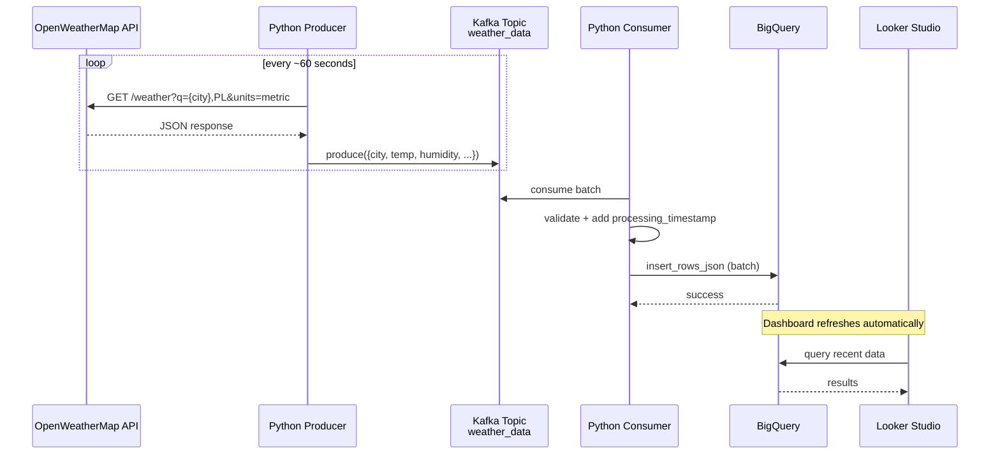

# Real-Time Polish Weather Data Pipeline

**Near real-time weather monitoring for Poland's 10 largest cities**  
using Apache Kafka, Python streaming ETL, Google BigQuery & Looker Studio.



## Overview

This portfolio project shows a clean, end-to-end **streaming / near-real-time ETL pipeline**:

- Fetches current weather data every ~60 seconds from OpenWeatherMap API for 10 major Polish cities  
- Publishes events to Apache Kafka (local KRaft mode)  
- Python consumer reads, validates, lightly transforms and batches records  
- Loads data into Google BigQuery (free tier friendly)  
- Looker Studio dashboard visualizes live trends and current conditions

Perfect demonstration of real-time ingestion, decoupling with Kafka, Python processing and serverless analytics.

## Features

- Near-real-time refresh (~60-second interval)  
- Simple data quality / validation in consumer  
- Batch loading to BigQuery to respect free tier costs  
- At-least-once delivery (idempotent inserts possible in future)  
- Easy-to-extend Looker Studio dashboard

## Architecture


## Technologies & Rationale

| Layer                  | Technology                          | Why chosen                                                                 |
|------------------------|-------------------------------------|----------------------------------------------------------------------------|
| Streaming broker       | Apache Kafka (KRaft mode)           | De-facto standard for event streaming & decoupling producers/consumers     |
| Ingestion              | Python + `requests`                 | Lightweight, no heavy frameworks needed                                    |
| Serialization          | JSON                                | Readable, debug-friendly, sufficient for low-volume streaming              |
| Processing & Sink      | Python + `google-cloud-bigquery`    | Native GCP client, simple & reliable batch inserts                         |
| Storage & Query        | Google BigQuery                     | Serverless, 1 TB free queries + 10 GB storage/month – ideal for portfolio  |
| Visualization          | Looker Studio                       | Free, native BigQuery integration, beautiful dashboards in minutes         |
| Local Infra & Dev      | Docker Compose + VS Code            | Zero-cost, reproducible local development environment                      |

## How to Run – Step-by-Step (One-Window Guide)

### Prerequisites
Before starting:
- **Docker** + **Docker Compose** installed
- **Python 3.9+** (strongly recommended: use a virtual environment)
- Google Cloud project with **BigQuery API** enabled
- Service Account JSON key with roles:
  - BigQuery Data Editor
  - BigQuery Job User
- Free **OpenWeatherMap API key** → [Sign up here](https://home.openweathermap.org/users/sign_up)

### Step 1 – Clone the repository
```bash
git clone https://github.com/YOUR_USERNAME/real-time-polish-weather-kafka-pipeline.git
cd real-time-polish-weather-kafka-pipeline
```


### Step 2 – Set up environment variables
```bash
cp .env.example .env
```
## Required: OpenWeatherMap
- OPENWEATHER_API_KEY=xxxxxxxxxxxxxxxxxxxxxxxxxxxxxxxx

## Required: Google Cloud
- GCP_PROJECT_ID=your-project-id-123456
- GCP_SERVICE_ACCOUNT_KEY_PATH=/full/absolute/path/to/your-service-account-key.json

## Kafka (local) 
- KAFKA_BOOTSTRAP_SERVERS=localhost:9092
- KAFKA_TOPIC=weather_data

### Step 3 – Start Kafka (and optionally Kafka UI)
```bash
docker compose up -d
```
