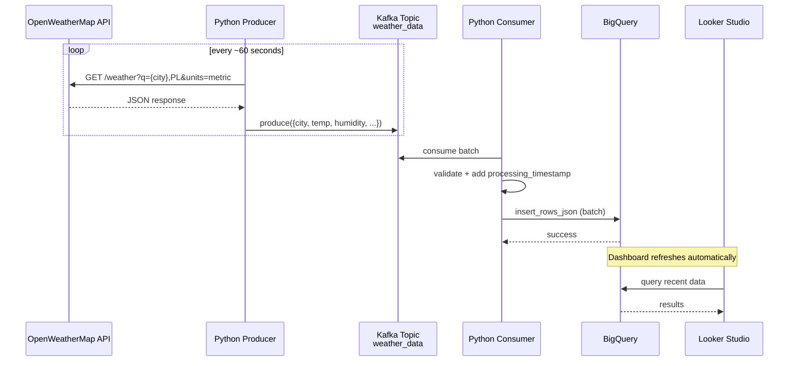
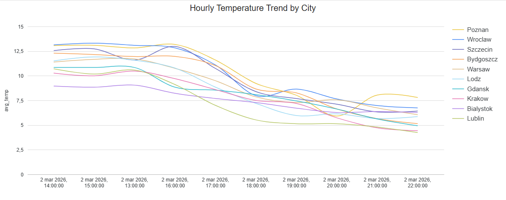
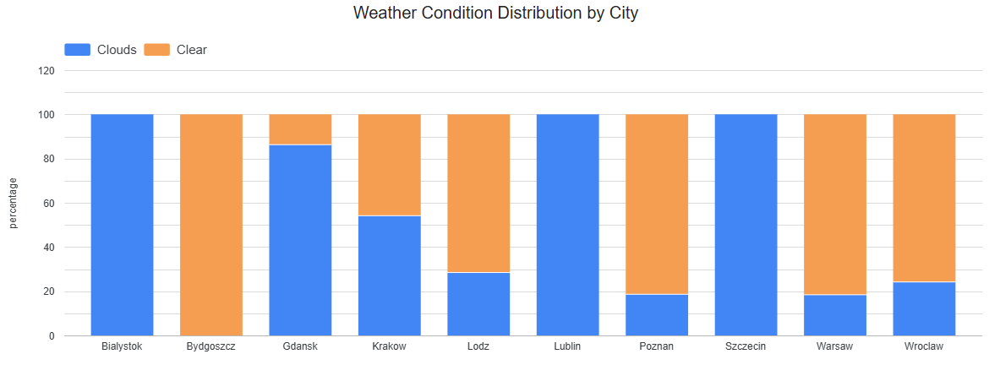
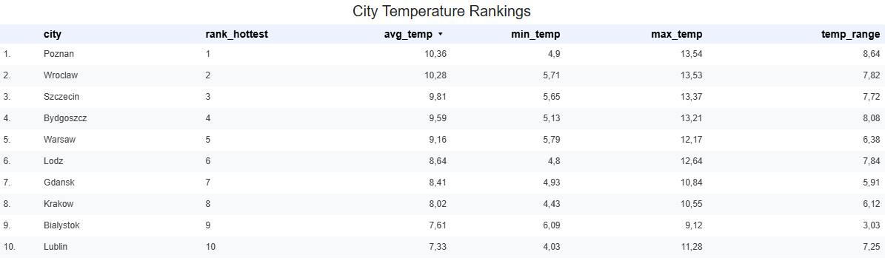
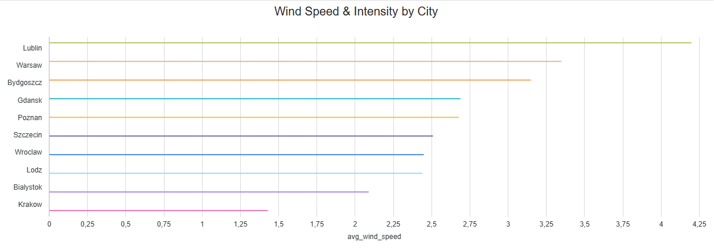
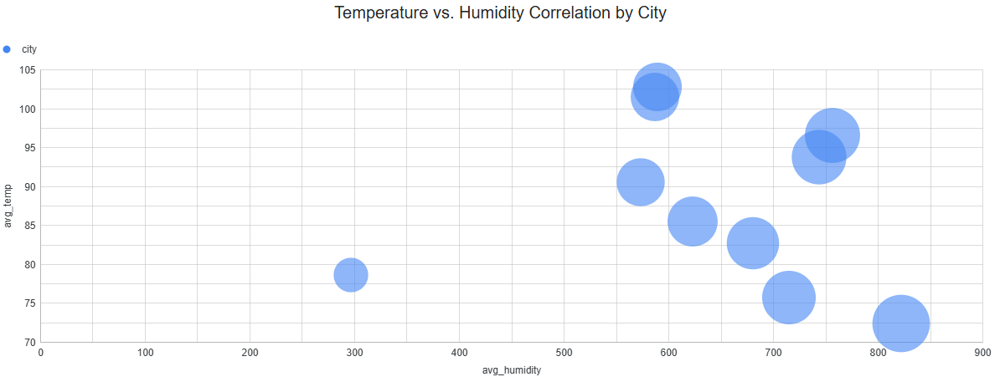

# Real-Time Polish Weather Data Pipeline

**Near real-time weather monitoring for Poland's 10 largest cities**  
using Apache Kafka, Python streaming ETL, Google BigQuery & Looker Studio.



## Project Overview

This portfolio project demonstrates a clean, end-to-end **near-real-time streaming ETL pipeline** for monitoring current weather in Poland's 10 largest cities.

### What it does
- Fetches live weather data every ~60 seconds from the OpenWeatherMap API (temperature, humidity, wind, conditions, etc.)  
- Publishes structured JSON events to **Apache Kafka** (running locally in single-node KRaft mode)  
- A Python consumer continuously reads from Kafka, performs lightweight validation & transformation, and batches records  
- Loads clean batches into **Google BigQuery** (optimized for free tier limits)  
- Enables quick visualization of trends and current conditions in a **Looker Studio** dashboard

## Technologies & Rationale

| Layer                  | Technology                          | Why chosen                                                                 |
|------------------------|-------------------------------------|----------------------------------------------------------------------------|
| Streaming broker       | Apache Kafka (KRaft mode)           | De-facto standard for event streaming & decoupling producers/consumers     |
| Ingestion              | Python + `requests`                 | Lightweight, no heavy frameworks needed                                    |
| Serialization          | JSON                                | Readable, debug-friendly, sufficient for low-volume streaming              |
| Processing & Sink      | Python + `google-cloud-bigquery`    | Native GCP client, simple & reliable batch inserts                         |
| Storage & Query        | Google BigQuery                     | Serverless, 1 TB free queries + 10 GB storage/month – ideal for portfolio  |
| Visualization          | Looker Studio                       | Free, native BigQuery integration, beautiful dashboards in minutes         |
| Local Infra & Dev      | Docker Compose + VS Code            | Zero-cost, reproducible local development environment                      |

## How to Run – Step-by-Step (One-Window Guide)

### Prerequisites
Before starting:
- **Docker** + **Docker Compose** installed
- **Python 3.9+** (strongly recommended: use a virtual environment)
- Google Cloud project with **BigQuery API** enabled
- Service Account JSON key with roles:
  - BigQuery Data Editor
  - BigQuery Job User
- Free **OpenWeatherMap API key** → [Sign up here](https://home.openweathermap.org/users/sign_up)

## Step 1 – Clone the repository
```bash
git clone https://github.com/YOUR_USERNAME/real-time-polish-weather-kafka-pipeline.git
cd real-time-polish-weather-kafka-pipeline
```

## Step 2 – Set up environment variables
```bash
cp .env.example .env
```
### Open .env in your editor and fill in:
#### Required: OpenWeatherMap
- OPENWEATHER_API_KEY=xxxxxxxxxxxxxxxxxxxxxxxxxxxxxxxx

#### Required: Google Cloud
- GCP_PROJECT_ID=your-project-id-123456
- GCP_SERVICE_ACCOUNT_KEY_PATH=/full/absolute/path/to/your-service-account-key.json

#### Kafka (local) 
- KAFKA_BOOTSTRAP_SERVERS=localhost:9092
- KAFKA_TOPIC=weather_data

## Step 3 – Start Kafka (and optionally Kafka UI)

## 3a. Start the Kafka broker
```bash
docker compose up -d
```
### Wait ~20–40 seconds for startup.
Create the topic:
```bash
Bashdocker exec kafka-broker kafka-topics.sh --create \
  --topic weather_data \
  --bootstrap-server localhost:9092 \
  --partitions 3 \
  --replication-factor 1
```

### Quick check:
```bash
docker ps   # → you should see kafka-broker running
```

## 3b. Add Kafka UI for easy monitoring
Edit your existing docker-compose.yml and add this service at the end:
```yaml
  kafka-ui:
    image: provectuslabs/kafka-ui:latest
    container_name: kafka-ui
    ports:
      - "8080:8080"
    depends_on:
      - kafka
    environment:
      KAFKA_CLUSTERS_0_NAME: local
      KAFKA_CLUSTERS_0_BOOTSTRAPSERVERS: kafka:9092
      DYNAMIC_CONFIG_ENABLED: 'true'
```
### Then restart:
```bash
docker compose up -d

```
### Open in browser: http://localhost:8080

## Step 4 – Prepare Python environment & install dependencies
```bash
# Create and activate virtual environment (highly recommended)
python -m venv .venv
Windows:   .venv\Scripts\activate
# Install packages
pip install -r requirements.txt
```

## Step 5 – Launch the Producer (fetches weather data)
### Open a new terminal, go to project folder and run:
```bash
python producer/producer.py
```
## Step 6 – Launch the Consumer (processes & loads to BigQuery)
### Open another terminal, go to project folder and run:
```bash
python consumer/consumer.py
```

## Step 7 – Verify everything works
- Kafka UI (if added): http://localhost:8080 → check weather_data topic for incoming messages
- BigQuery: Go to https://console.cloud.google.com/bigquery
- 
Run this query (replace your-project-id):

```sql
SELECT *
FROM `your-project-id.weather_dataset.raw_weather`
ORDER BY ingestion_timestamp DESC
LIMIT 10
```

## Looker Studio Dashboard – Key Visualizations  
(All charts based on data collected 2 March 2026, 14:00–22:00)

| Name                                      | Description                                                                 | Dashboard                                                                 |
|-------------------------------------------|-----------------------------------------------------------------------------|---------------------------------------------------------------------------|
| Hourly Temperature Trend by City          | Line chart showing hourly average, min and max temperatures per city (2 Mar 2026, 14–22). Highlights short-term changes and evening cooling patterns. |  |
| Weather Condition Distribution by City    | Shows frequency and % of weather types (Clear, Clouds, Rain etc.) per city during the 8-hour evening window on 2 Mar 2026. |  |
| City Temperature Rankings                 | Ranks Polish cities by average temperature (with min/max and range) based on data from 2 Mar 2026, 14:00–22:00. |    |
| Wind Speed & Intensity by City            | Displays average & max wind speed per city with intensity categories for the evening hours of 2 March 2026. |  |
| Temperature vs. Humidity Correlation by City | Scatter plot of hourly temperature vs humidity (colored by humidity level) for 2 Mar 2026, 14–22, showing comfort conditions. |  ||

